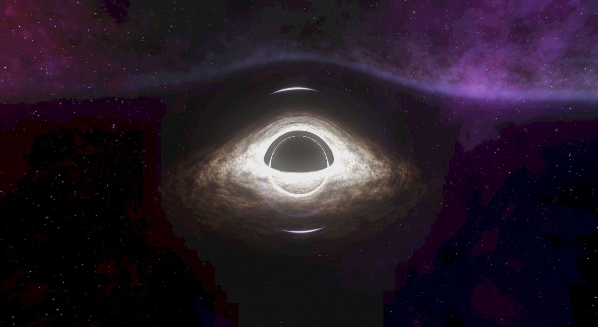

# 黑洞渲染器 (BlackHole Renderer)

一个基于 Three.js 和 WebGL 的黑洞物理渲染器，实现了引力透镜、吸积盘等物理效果。

## 演示效果



## 项目结构

```
BlackHole/
├── index.html              # 主页面
├── src/
│   ├── main.js             # 主程序入口
│   ├── shaders/            # Shader 文件
│   │   ├── blackhole.vert  # 黑洞顶点着色器
│   │   ├── blackhole.frag  # 黑洞片段着色器
│   │   ├── bloom_brightness.frag  # Bloom 亮度提取
│   │   ├── bloom_down.frag        # Bloom 下采样
│   │   ├── bloom_up.frag          # Bloom 上采样
│   │   ├── bloom_composite.frag   # Bloom 合成
│   │   └── tonemapping.frag       # 色调映射
│   └── utils/
│       └── shaderLoader.js # Shader 加载工具
└── assets/                 # 资源文件
    ├── color_map.png       # 颜色映射贴图
    └── skybox_nebula_dark/ # 天空盒贴图
        ├── back.png
        ├── bottom.png
        ├── front.png
        ├── left.png
        ├── right.png
        └── top.png
```

## 功能特性

- **黑洞渲染**: 基于物理的黑洞视觉效果
- **引力透镜**: 实现光线弯曲效果
- **吸积盘**: 动态的吸积盘渲染，包含噪声和旋转
- **Bloom 效果**: 多级泛光后处理
- **色调映射**: ACES 色调映射算法
- **实时控制**: GUI 控制面板，可调节各种参数

## 使用方法

1. 直接在浏览器中打开 `index.html`
2. 使用右侧的 GUI 控制面板调节参数：
   - **摄像机**: 调节视野缩放
   - **黑洞**: 调节步长、步数、引力透镜强度
   - **吸积盘**: 调节各种吸积盘参数
   - **泛光效果**: 调节 Bloom 强度和迭代次数

## 技术实现

- **Three.js**: 3D 渲染框架
- **WebGL**: 底层图形 API
- **GLSL**: 着色器语言
- **lil-gui**: GUI 控制面板
- **Stats.js**: 性能监控

## 渲染管线

1. **黑洞渲染**: 使用光线追踪算法渲染黑洞和吸积盘
2. **亮度提取**: 提取高亮度区域用于泛光效果
3. **Bloom 处理**: 多级下采样和上采样
4. **合成**: 将基础图像和泛光效果合成
5. **色调映射**: HDR 到 LDR 的转换
6. **输出**: 最终渲染到屏幕

## 浏览器兼容性

- Chrome 80+
- Firefox 75+
- Safari 13+
- Edge 80+

需要支持 WebGL 2.0 的现代浏览器。
